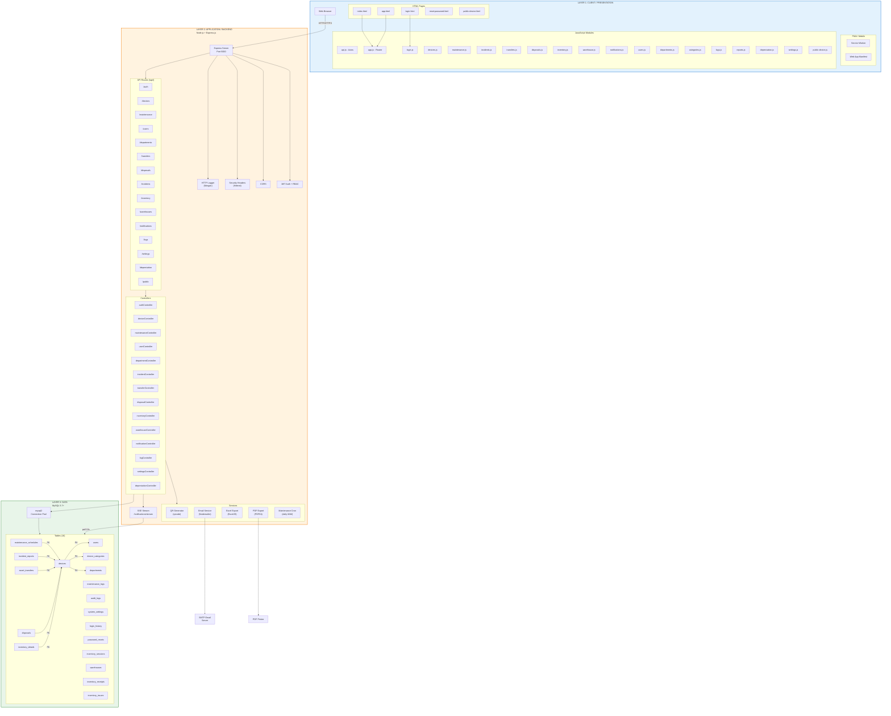
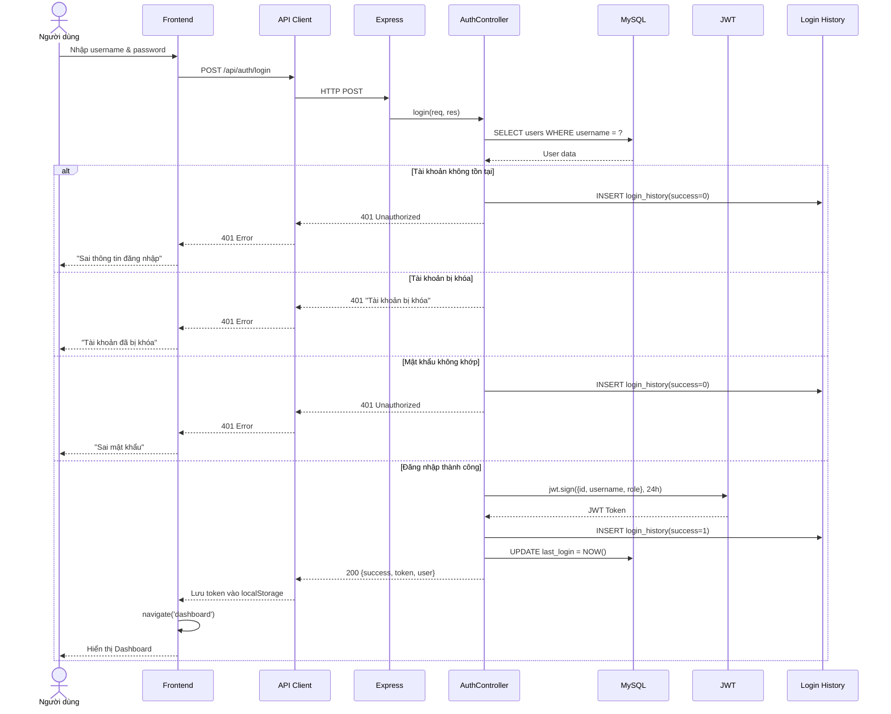
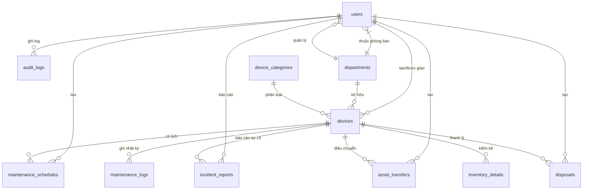
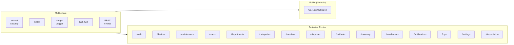

## TVU-ITAM Mermaid Diagrams

### 1. Sơ đồ Kiến trúc Tổng thể

### 2. Sơ đồ Use Case (4 Tác nhân)

```mermaid
graph TB
    subgraph Guest["👤 Khách (Guest)"]
        G1["📱 Quét mã QR\nthiết bị"]
        G2["🔍 Tra cứu thông tin\ncông khai"]
    end

    subgraph User["👤 Người dùng (User)"]
        U1["🔑 Đăng nhập"]
        U2["📊 Xem Dashboard\nTổng quan"]
        U3["📋 Xem danh sách\nthiết bị"]
        U4["📄 Chi tiết\nthiết bị"]
        U5["⚠️ Gửi báo cáo\nhỏng hóc"]
        U6["🔔 Theo dõi tiến độ\nxử lý"]
    end

    subgraph Admin["👤 Quản trị viên (Admin)"]
        A1["🔑 Đăng nhập"]
        A2["📊 Dashboard\nquản trị"]
        A3["🖥️ Quản lý thiết bị\nThêm/Sửa/Xóa"]
        A4["📤 Import/Export\nXem QR, In Excel/PDF"]
        A5["🔧 Quản lý bảo trì\nLập phiếu/Phân công/Ghi nhận"]
        A6["🚨 Xử lý sự cố\nBáo cáo/Phân công/Đóng"]
        A7["📁 Điều chuyển\ntài sản"]
        A8["🏭 Thanh lý\ntài sản"]
        A9["📈 Báo cáo\nthống kê"]
    end

    subgraph SuperAdmin["👤 Quản trị hệ thống (SuperAdmin)"]
        S1["🔑 Đăng nhập"]
        S2["📊 Dashboard\nhệ thống"]
        S3["👥 Quản lý\nngười dùng"]
        S4["🏢 Quản lý\nphòng ban"]
        S5["🔍 Xem nhật ký\nhoạt động"]
        S6["⚙️ Cấu hình\nhệ thống"]
        S7["📋 Toàn bộ\nquyền quản trị"]
    end

    G1 --> G2
    U1 --> U2 --> U3 --> U4 --> U5 --> U6
    A1 --> A2 --> A3 --> A4 --> A5 --> A6 --> A7 --> A8 --> A9
    S1 --> S2 --> S7 --> S3 --> S4 --> S5 --> S6

    classDef guestStyle fill:#E3F2FD,stroke:#1976D2,stroke-width:2px,color:#0D47A1
    classDef userStyle fill:#E8F5E9,stroke:#388E3C,stroke-width:2px,color:#1B5E20
    classDef adminStyle fill:#FFF3E0,stroke:#F57C00,stroke-width:2px,color:#E65100
    classDef superStyle fill:#F3E5F5,stroke:#7B1FA2,stroke-width:2px,color:#4A148C

    class G1,G2 guestStyle
    class U1,U2,U3,U4,U5,U6 userStyle
    class A1,A2,A3,A4,A5,A6,A7,A8,A9 adminStyle
    class S1,S2,S3,S4,S5,S6,S7 superStyle
```

### 3. Sơ đồ Luồng Đăng nhập

### 4. Sơ đồ Cơ sở dữ liệu (ERD)

### 5. Sơ đồ API Routes

**Lưu ý quan trọng:**
1. **Mermaid không nhận emoji** làm tên node → tôi đã thay bằng text thuần
2. **Subgraph giống package** trong PlantUML
3. **Màu sắc** được định nghĩa bằng `classDef`
4. Copy từng block vào tool hỗ trợ Mermaid:
   - https://mermaid.live
   - https://mermaid-js.github.io/mermaid-live-editor/
   - Hoặc GitHub README (hỗ trợ native)
